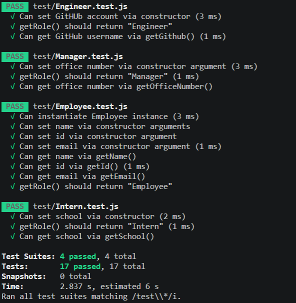
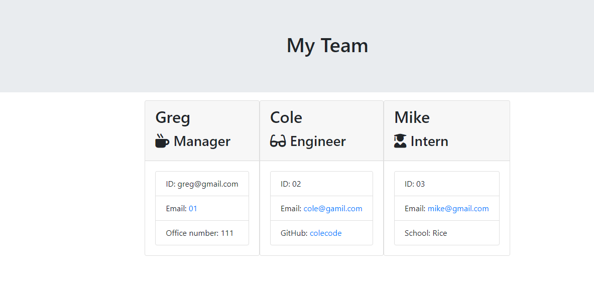

# Team Profile Generator

# Description

Team generator command line application.The application will prompt the user for information about the team manager 
and then information about the team members. The user can input any number of team members, and they may be a mix of engineers and interns. 

# Table of Contents

* [Installation](#installation)

* [Usage](#usage)

* [License](#license)

* [Contributing](#contributing)

* [Tests](#tests)

* [Questions](#questions)

# Installation

Dependencies must be installed to run the application properly: "npm install"

# Usage

Team generator command line application.

#

#
[Video Demo Link](https://drive.google.com/file/d/1P2MT2J2JAquz0VcN-iannpQyfKtuQBcF/view?usp=sharing)

#

[Video Demo Link NPM Run Test](https://drive.google.com/file/d/1v4cCRTGio5vwu6afqIWiG4UKWQvHGJfp/view?usp=sharing)

#

# License

This project is license under the MIT license.

# Contributing

​Contributors: Gregory Nguenang

# Tests

To run tests, you need to run the following command: "npm run test"

# Questions

If you have any questions feel free to ask. 

* github username: @NGUENANG7

* Email: njethur@gmail.com
